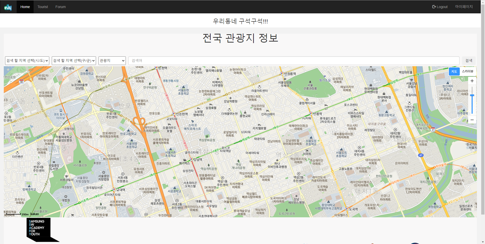
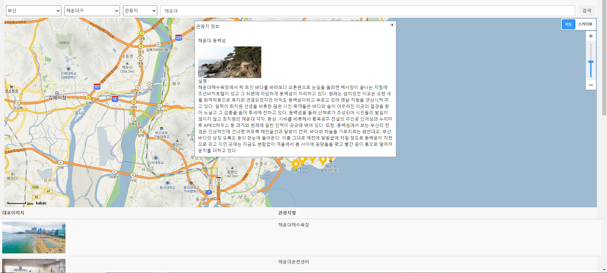

### 처리된 요구사항 목록
  
|난이도|구현기능|세부|작성여부(O/X)|
|:---:|---|---|:---:|
|기본|지역별 관광지 정보 수집|한국관광공사 : 지역별 관광지 정보를 얻어와 화면에 표시|O|
|기본|관광지, 숙박, 음식점 조회|관광지별 정보를 지역별 원하는 컨텐츠 별 조회|O|
|기본|문화시설, 공연, 여행코스, 쇼핑 조회|관광지별 정보를 지역별 원하는 컨텐츠 별 조회|O|
|추가|여행 계획 경로 설정|조회한 관광지를 활용하여 여행 계획, 여행 경로를 저장|X|
|추가|회원 주도의 hotplace 등록|지도와 사진을 활용한 hotplace 등록|X|
|심화|관광지 관련 뉴스 정보 크롤링|관광지 정보를 크롤링하여 DB에 저장|X|
|기본|회원관리페이지|회원 가입, 수정, 조회, 탈퇴|O|
|기본|로그인 관리|로그인|O|
|기본|로그인 관리|로그아웃|O|
|기본|로그인 관리|비밀번호 찾기|O|
|심화|공지사항|공지사항 등록, 수정, 삭제, 조회|X|
|심화|공유게시판|게시판 등록, 수정, 삭제, 조회|O|
|심화|관광지 날씨|관광지의 기간별 날씨 출력|X|
|심화|관광지 사진|관광지별 추천 사진 출력|O|
|심화|일출, 일몰시각|관광지별 일출, 일몰시간 출력|X|
|심화|전기자동차 충전소|전기자동차 충전소의 위치 및 충전 상태 출력|X|

### 실행화면 캡쳐

구현 기능: 지역별 관광지 정보 수집

구현 기능: 관광지, 숙박, 음식점 조회
지역별 관광지 조회(관광지)
.png)

지역별 관광지 조회(숙박) 
.png)

지역별 관광지 조회(음식점)
.png)

구현 기능: 문화시설, 공연, 여행코스, 쇼핑 조회
지역별 관광지 조회(문화시설)
.png)

지역별 관광지 조회(공연)
.png)

지역별 관광지 조회(여행코스)
.png)

지역별 관광지 조회(쇼핑)
.png)

구현 기능: 회원관리

회원가입

.png)

수정

.png)

조회

.png)

탈퇴

.png)

구현 기능: 로그인 관리

로그인
.png)

로그아웃
.png)

비밀번호 찾기

.png)

.png)

구현 기능: 공유게시판

등록

.png)

수정

.png)

삭제

.png)

조회

.png)

.png)

구현 기능: 관광지 사진

관광지별 추천 사진 출력

